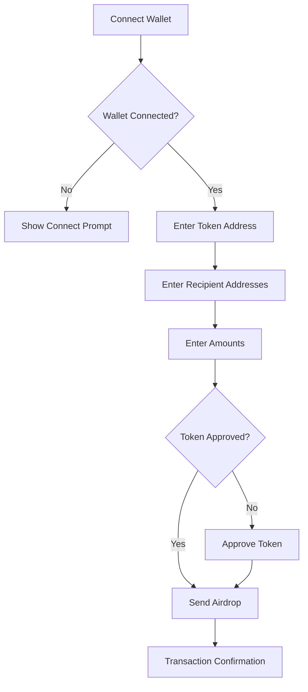
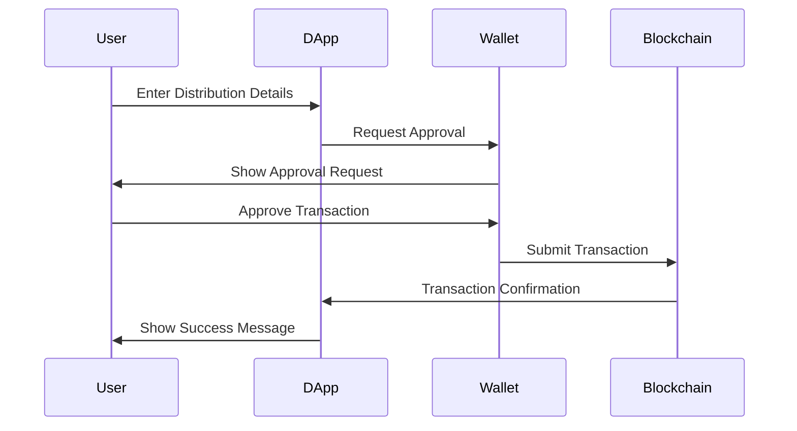

# 🚀 Token Sender DApp

A powerful decentralized application for efficient token distribution and airdrops on the blockchain.


## 🌟 Features

- 🔐 Secure wallet integration
- 💸 Multi-recipient token distribution
- ⚡ Single transaction for multiple transfers
- 🔄 Automatic token approval
- 📊 Real-time transaction status
- 🎯 Support for both ETH and Wei denominations
- 🛡️ Built-in error handling and validation

## 📋 User Flow



## 🛠️ Technologies

- **Frontend Framework**: [Next.js](https://nextjs.org/)
- **Smart Contracts**: Solidity 0.8.26
- **Web3 Integration**: [Wagmi](https://wagmi.sh/) + [Viem](https://viem.sh/)
- **Styling**: [Tailwind CSS](https://tailwindcss.com/)
- **Development**: [Foundry](https://book.getfoundry.sh/)

## 🚀 Getting Started

### Prerequisites

- Node.js (v18 or higher)
- MetaMask or any Web3 wallet
- Foundry (for smart contract development)

### Installation

1. Clone the repository
```bash
git clone https://github.com/yourusername/token-sender-dapp.git
cd token-sender-dapp
```

2. Install dependencies
```bash
npm install
```

3. Start the development server
```bash
npm run dev
```

4. Open [http://localhost:3000](http://localhost:3000) in your browser

## 💻 Usage Guide

### 1. Connect Your Wallet
- Click the "Connect Wallet" button
- Select your preferred wallet provider
- Approve the connection request

### 2. Prepare Token Distribution
- Enter the token contract address
- Add recipient addresses (comma-separated or new line)
- Specify amounts for each recipient
- Choose between ETH or Wei denomination

### 3. Execute Airdrop
- Review the transaction details
- Approve token spending if required
- Confirm the airdrop transaction
- Wait for blockchain confirmation

## 🔒 Security Features

- Input validation for addresses and amounts
- Transaction confirmation requirements
- Gas estimation and optimization
- Error handling and user feedback
- Secure wallet integration

## 📊 Transaction Flow



## 🤝 Contributing

We welcome contributions! Please feel free to submit a Pull Request.

1. Fork the repository
2. Create your feature branch (`git checkout -b feature/AmazingFeature`)
3. Commit your changes (`git commit -m 'Add some AmazingFeature'`)
4. Push to the branch (`git push origin feature/AmazingFeature`)
5. Open a Pull Request

## 📝 License

This project is licensed under the MIT License - see the [LICENSE](LICENSE) file for details.

## 🙏 Acknowledgments

- [Next.js](https://nextjs.org/) for the amazing framework
- [Wagmi](https://wagmi.sh/) for Web3 integration
- [Tailwind CSS](https://tailwindcss.com/) for styling
- [Foundry](https://book.getfoundry.sh/) for smart contract development

## 📞 Support

For support, please open an issue in the GitHub repository or contact us at [info@vicenteaguilar.com](mailto:info@vicenteaguilar.com).

---

Made with ❤️ by [Vicent00]
