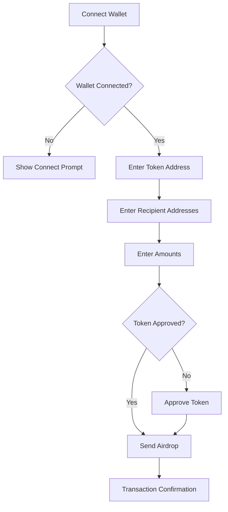
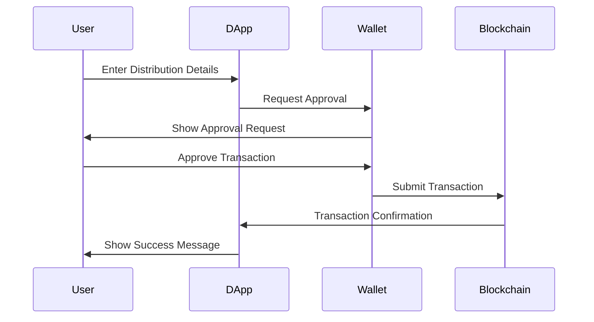

# 🚀 Token Sender DApp

> The Ultimate Token Distribution Platform for Web3


## 🌟 Why Token Sender?

- 🔐 Secure wallet integration
- 💸 Multi-recipient token distribution
- ⚡ Single transaction for multiple transfers
- 🔄 Automatic token approval
- 📊 Real-time transaction status
- 🎯 Support for both ETH and Wei denominations
- 🛡️ Built-in error handling and validation

## ✨ Key Features



## 🛠️ Tech Stack

- **Frontend**: Next.js + TypeScript
- **Smart Contracts**: Solidity 0.8.26
- **Web3**: Wagmi + Viem
- **Styling**: Tailwind CSS
- **Development**: Foundry

## 🚀 Quick Start

```bash
# Clone the repository
git clone https://github.com/yourusername/token-sender-dapp.git

# Install dependencies
npm install

# Start development server
npm run dev
```

4. Open [http://localhost:3000](http://localhost:3000) in your browser

## 💻 Usage Guide

### 1. Connect Your Wallet
- Click the "Connect Wallet" button
- Select your preferred wallet provider
- Approve the connection request

### 2. Prepare Token Distribution
- Enter the token contract address
- Add recipient addresses (comma-separated or new line)
- Specify amounts for each recipient
- Choose between ETH or Wei denomination

1. **Connect Wallet** - Secure integration with your preferred Web3 wallet
2. **Enter Details** - Input token address and recipient information
3. **Review & Send** - Verify details and execute the distribution
4. **Track Progress** - Monitor transaction status in real-time

## 🔒 Security Features

- Input validation for all addresses and amounts
- Transaction confirmation requirements
- Gas optimization
- Comprehensive error handling
- Secure wallet integration

## 📊 Transaction Flow



## 🤝 Contributing

We love your input! We want to make Token Sender the best it can be, and we can't do it without you.

1. Fork the repository
2. Create your feature branch (`git checkout -b feature/AmazingFeature`)
3. Commit your changes (`git commit -m 'Add some AmazingFeature'`)
4. Push to the branch (`git push origin feature/AmazingFeature`)
5. Open a Pull Request

## 📝 License

This project is licensed under the MIT License - see the [LICENSE](LICENSE) file for details.

## 🙏 Acknowledgments

- [Next.js](https://nextjs.org/) for the amazing framework
- [Wagmi](https://wagmi.sh/) for Web3 integration
- [Tailwind CSS](https://tailwindcss.com/) for styling
- [Foundry](https://book.getfoundry.sh/) for smart contract development

## 📞 Support

For support, please open an issue in the GitHub repository or contact us at [info@vicenteaguilar.com](mailto:info@vicenteaguilar.com).

---

Made with ❤️ by [Vicent00]
